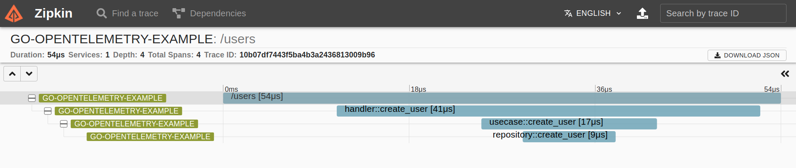
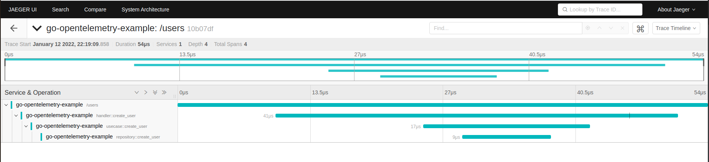

<h1 align="center">go-opentelemetry-example</h1>
<p align="center">
    
</p>

## Objective

Example of trace instrumentation in Golang applications using the [opentelemetry](https://opentelemetry.io/) pattern.

## Requirements/dependencies
- Docker
- Docker-compose
- Golang

## Getting Started

- Starting containers

```sh
make up
```

- Starting API in port `:8080`

```sh
make start
```

- Create traces

```sh
make request
```

- Kill containers

```sh
make down
```

## Exporters

### Zipkin

- exposed front-end in `http://localhost:9411`



### Jaeger

- exposed front-end in `http://localhost:16686/`


